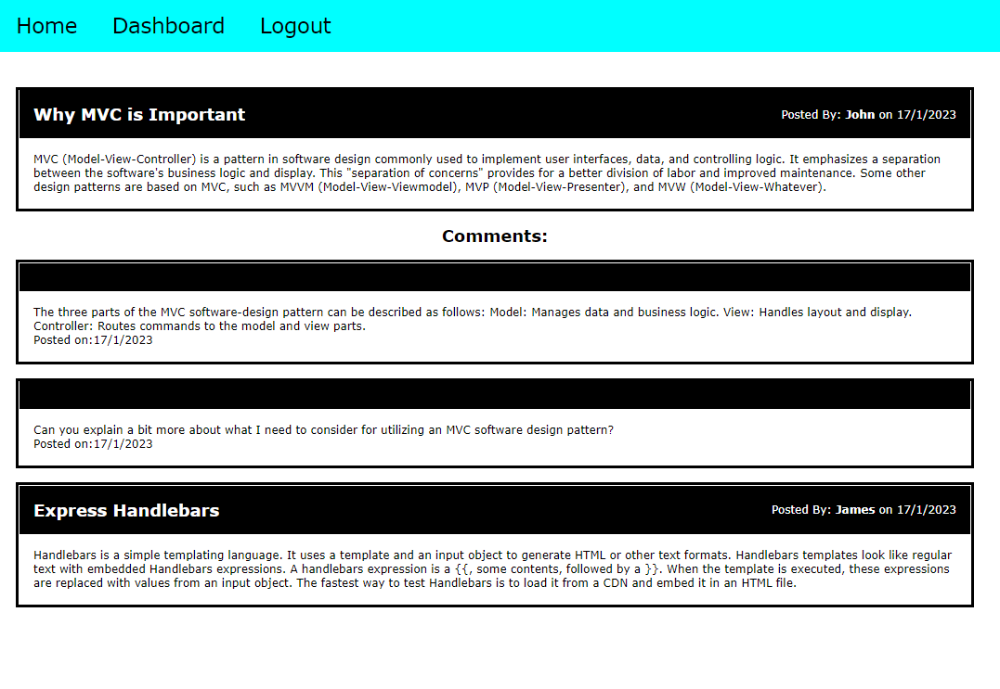

# Blog Site 
-	A blog site app created with the MVC paradigm in its architectural structure, using Handlebars.js as the templating language, Sequelize as the ORM, and the express-session npm package for authentication.
# Features for the App 
-----------------------------------------------------------------------  
-	When a user visits the site for the first time, the homepage, which includes existing blog posts and comments from other users is displayed. if any have been posted; the homepage and the option to log in are presented at the top of the navigation bar. 
-	When a user clicks links in the navigation they are prompted to either sign up or sign in. If the user chooses to sign up a prompt to create a username and password. Then when click on the sign-up button user credentials are saved. 
-	The user will be able to use the login credentials to sign in and can be logged into the site. If users revisit the site at a later time and choose to sign in, they can do so with the saved credentials.
-	Once signed in user can see navigation links for the homepage, the dashboard, and the option to log out. They can click on the homepage option in the navigation and taken to the homepage and presented with existing blog posts that include the post title and the date created
-	If the user clicks on an existing blog post they are presented with the post title, contents, post creator’s username, and date created for that post and have the option to leave a comment.
-	When the user enters a comment and clicks on the submit button while signed in, the comment is saved and the post is updated to display the comment, the comment, and the date created.
-	If the user clicks on the home option in the navigation, they are taken to the dashboard and presented with any blog posts I have already created and the option to add a new blog post.
-	When users click on the button to add a new blog post they will be prompted to enter both a title and content for their blog post.  When the user clicks on the button to create a new blog post, the title and contents of the user’s post are saved and are taken back to an updated dashboard with my new blog post.
-	If the user clicks on one of their existing posts in the dashboard, they can delete or update their post and be taken back to an updated dashboard.
-	When the user clicks on the logout option in the navigation, they are signed out of the site
-	Users are able to view comments but are prompted to log in again before they can add, update, or delete comments.


# Built with
-----------------------------------------------------------------------
-	express
-	express-handlebars
-	express-sessions
-	mysql2
-	sequelize
-	bcrypt
-	connect-session-sequelize
-	dotenv
## Installation
-----------------------------------------------------------------------

Installations needed to use the App 
```bash
-	npm install 
-	npm install express
-	npm install mysql2
-	npm install sequelize
-	npm install dotenv
-	npm install express-handlebars
-	 npm install sessions
-	 npm install bcrypt
```
# Links
-----------------------------------------------------------------------
### [Deployed App]()
### [Repository]()


# Screenshot:
----------------------------------------------------------------------

 

# Usage:
----------------------------------------------------------------------
-	A blog App with a user interface that allows for posting and commenting on a blog. Any user can see the blogs or comments. However, creating an account and logging in is required for posting, updating, or commenting on the site.  
# License:
-----------------------------------------------------------------------
[MIT](https://choosealicense.com/licenses/mit/)
